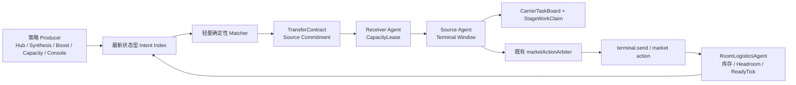

## Context

当前跨房物流虽然运行在同一个 Screeps bundle 中，却存在多套互不完整的控制面：Hub、Synthesis、PowerBank、capacity relief、survival energy 和 console 分别计算需求；`Memory.data.resourceControl.tasks` 只保存来源、目标、资源、剩余量和粗粒度 blocker；ResourceControl 再集中完成匹配、发送、staging、market 与 analytics。现有模型缺少以下边界：

- producer 的“需求”与 executor 的“动作”没有分离，Hub 既是策略中心又常被当作物理中转；
- priority 由 executor 解析 `reason` 字符串，任务没有稳定的业务优先级字段；
- source stock 与 receiver headroom 没有跨 tick 的唯一承诺所有者；
- terminal feed 只按房间+资源聚合，多个 carrier 没有持久 claim，global reset 后只能依赖进程内 board 重建；
- survival energy 仍是绕过 transfer-task 进度账本的独立 send proposal；其副作用虽已通过 `marketActionArbiter`，却没有与其他 transfer 共享剩余量/交付进度；
- automatic task 的 merge/upsert 可能刷新 desired amount，却不能可靠区分需求修订与实际发送进度。

P0 `terminal-headroom-recovery` 负责共享水位、物理 headroom oracle、恢复性 offload 和 legacy staging admission；`production-logistics-liveness` 负责 automatic incoming 的有界 demand coverage、每合成房单一 assignment 与 Hub-owned config revision/reconcile。纯 Shadow 可在共享 oracle/本地回归与 `production-logistics-liveness` live 验收成为可用读基线后上线，但不得因此声称 receiver 恢复闭环已经通过 live canary；`terminal-headroom-recovery` 6.4 必须在任何 contract authority canary 之前独立关闭。P1 必须复用这两组安全事实，不能把 blocked legacy task 或幽灵合成 assignment 当成 Shadow 真值。

本仓库同时已经具备三条不能重复实现的执行边界：`marketActionArbiter` 是 terminal send/deal 的每房每 tick claim 与 journal；Dispatch Ownership 提供完整 `CarrierDispatchRef`、owner-aware `CarrierTaskBoard` 和 tick-bound `CarrierAmountSlicePort`；Terminal Energy ownership 提供动作 fee/payload 预算。P1 新增的是跨 tick contract/lease/claim 事实与房间级选择，不是第二套 terminal lock、Carrier board 或同 tick amount ledger。

“去中心化”在本项目中是逻辑所有权的去中心化，不是分布式系统共识：所有代码仍在单线程 tick 和共享 Memory 中运行。设计因此不需要 2PC、通用锁服务、event sourcing 或跨 shard 协议，只需要确定性匹配、receiver 单一授权、source 单一执行和可从 Memory 恢复的状态。

## Goals / Non-Goals

### Goals

- 把业务 producer 限定为“发布需求/供给”，把 receiver 容量授权和 source terminal side effect 分别交给对应房间的唯一逻辑 Agent。
- 用持久 TransferContract 统一所有跨房发送的幂等、数量守恒、优先级、阻塞、重试、改道、部分完成和 reset 恢复。
- 用 receiver 授予的短期 CapacityLease 防止跨 tick 和多 producer 重复承诺 headroom，同时保持发送前物理重验。
- 用 contract-aware、可过期的 carrier claim 防止重复 withdraw、过量 staging 和 global reset 后的丢单。
- 优先选择源到目标的直接路线，降低 Hub 容量与交易能耗；Hub 不可用时其他房间物流仍可运行。
- 保持候选计算、Memory 增长和每房执行工作有界，并用运行时指标证明安全、活性、公平性和 CPU 成本。
- 以默认 `disabled`、纯 `shadow`、按 `(origin, sourceRoom)` 的 `canary` 和全面 `enabled` 构成单向受控模式，并让回滚在 global reset 后可按持久 phase 恢复。

### Non-Goals

- 不实现纯 P2P 抢占、分布式共识、通用 lease/lock 框架、追加式事件日志或全局最优最小费用流。
- 不修改 P0 的容量水位、headroom recovery/offload 目标和 feed/offload 冲突规则。
- 不重新设计 energy、矿物、T3、boost、合成、PowerBank 或 market 定价阈值；除本变更明确规定的 terminal 仲裁顺序外，其他业务策略保持不变。
- 不改变 creep pathing/role 拓扑，不新增跨房 creep 搬运、多跳 terminal saga 或跨 shard 合同。
- 不重排 `src/main.ts` 的行为阶段；Agent 和 matcher 仍在现有 ResourceControl 阶段内执行。
- 不改变 console transfer 的调用入口；手工任务仍保持不因自动 TTL 取消、且不自动改道的语义。
- 不新建 terminal action lock/account claim，不替换 `marketActionArbiter`、Terminal Energy ownership、owner-aware `CarrierTaskBoard`、完整 Dispatch ref 或 `CarrierAmountSlicePort`。
- 不直接扩展被声明边界测试冻结的 `Memory.cfg/runtime/data/analytics` 根接口；持久合同数据先通过现有 owner 分支下的 versioned adapter 接入，schema 演进另立独立边界变更。
- 纯 Shadow 不以“线上没有 terminal action”作为目标；legacy executor 仍可正常发送。本阶段保证 Shadow 本身不新增 terminal/deal actor、claim、authority 或 side effect，并用 `disabled`/`shadow` 同 fixture 可观察状态差分和 send/deal mock 调用差分验证，而不是把全局 terminal 动作为零当作目标。

## Decisions

### 1. 采用“房间所有权 + 全局纯匹配”的混合架构

每个有 storage/terminal 的房间运行一个逻辑 `RoomLogisticsAgent`，负责发布本房最新事实、receiver lease grant、选择 source terminal proposal 与本地 staging。全局 matcher 只读取不可变的当轮快照和最新 intents，输出合同候选；它不直接搬运、不调用 terminal，也不能自行授予 receiver 容量。Agent 选中的 send/deal 仍必须调用既有 `marketActionArbiter`，由后者维持 terminal claim、account claim 与 action journal 的唯一事实。

选择该方案而不是纯 P2P，是因为 Screeps tick 是单线程共享 Memory：房间间消息与共识只会增加延迟和故障面。选择它而不是继续扩大 ResourceControl，是为了让容量授权和 terminal side effect 各有唯一 owner，并允许 Hub 退化为普通策略 producer。

### 2. Intent 只保存“最新目标”，不保存追加日志

每条 intent 使用稳定 `(producer, demandKey)`。caller 只提交最新语义 draft 与 TTL，包括 kind、room/resource、绝对 desired/available amount、priority、可选 deadline、固定 source/target、min batch 等约束；caller 不提交也不拥有 `id`、`generation`、`revision`、`observedAt` 或 `expiresAt`。store 负责物化这些生命周期字段，同一个 key 同时只允许一个 active revision：

- 同一未过期生命周期内，完全相同的语义 draft 视为 heartbeat：store 保留原 `generation/revision`，只允许 `observedAt/expiresAt` freshness 单调延长；不得创建新 commitment，也不得刷新任何执行 progress/`lastProgressAt`；
- 同一未过期生命周期内语义发生变化时，store 必须原子写入 `revision + 1`；该 revision 表示当前目标发生变化，不表示物流已经取得进展。caller 即使夹带 revision 字段也不能选择、保持或回退 store revision，因此不存在 caller 伪造“相同 revision 语义漂移”的双 authority；
- intent 已过期后再次发布，或 inactive intent 重新激活时，store 必须分配新的全局单调 `generation`、生成新的 intent id，并从该生命周期的 revision 1 开始；不得复用旧 identity；
- 需求量增加只为未承诺 delta 创建新合同；需求量减少优先撤销尚未 staging 的最新合同余量；
- 只有新的业务需求周期才更换 `demandKey`，从而避免把已交付量重新写回 remaining；
- 过期或撤销 intent 不再产生新合同，但不会抹掉已完成合同审计信息。

Room agent 生成新的 automatic offer 时可以使用 energy/mineral/T3 等业务水位；offer 可用量还必须扣除生产保护和所有 active source commitments。合同一旦存在，其 staging/send 的 Energy fee budget 只使用动作 ownership（ordinary Terminal reserve、生产、其他合同 payload/fee 与 market exposure），不得再次读取 room watermarks。Headroom intent 只报告 P0 oracle 的物理事实、同 tick projection、terminal cooldown/ready tick 和该动作 fee budget；尚未完成的 offload 不得被发布成即时容量。

不采用 event sourcing：本项目只需要当前调度事实，bounded contract history 足以审计，追加 intent 日志会无上限扩大 Memory。

首片在 `Memory.data.resourceControl.logistics` 中的 raw 表示固定为 `schemaVersion: 1`、`wireFormat: "compact-v1"` 的 canonical tuple wire：顶层只包含有序字符串表、intent/observation/room-fact/producer-snapshot tuples 与全局 lifecycle cursor。该 wire 只是当前 latest-state Shadow store 的内部持久编码，不是通用压缩日志、事件流或公开领域模型；模块对 caller/consumer 暴露的 decoded DTO、store-owned generation/revision 与 comparator 语义保持不变。

版本边界必须分开：`Memory.cfg.resourceControl.logistics` control 和上述 data wire 继续使用 `schemaVersion:1`，不随观测升级而改写；因 CPU 归因与差异因果投影改变，`Memory.runtime.resourceControl.logistics` 从本次修复起固定为 `schemaVersion:2`。runtime v1 只能作为旧窗口的历史兼容展示，不能成为新 10+100 的 liveness 样本或 CPU gate 真值。

codec 必须严格校验 tuple arity、string/intent index、enum index、非负安全整数、全局 cursor 不低于任何 active generation、集合唯一性/排序与 canonical re-encode；未知 wire、非 canonical tuple 或任何越界输入均 fail closed。旧 expanded-v1 只有在完整语义校验和 compact 编码均成功时才能原子迁移，迁移失败不得覆盖原值。任何 writer/cleanup 必须先对最终 raw compact wire 计算 UTF-8 JSON 字节数，只有 `<= 16 KiB` 才可 attach；不得靠部分 attach、提高上限或静默剪尾伪造成功。固定 8 rooms、16 intents、16 observations、8 unique demand resources 且每房包含全部 8 resource facts 的 live-like fixture，canonical raw 实测为 5,043 bytes，必须作为容量回归保留。

### 2A. 首个 Synthesis Shadow 使用写前冻结输入与精确 legacy 配对

首片只接入一个规范 origin：`synthesis_room`，即启用中 room synthesis reaction 的 reagent demand，对应 legacy `synthesis:<room>:<product>`。scope 必须由 typed `synthesisControl` producer/hook 标记，不得用 `reason.startsWith("synthesis:")` 推断，因为 Hub distributed reason 共用该前缀。首片 `priorityClass` 固定为 `production`，与 legacy rank 2 做语义对照；当前 room reaction 没有 deadlineAt，不得从 stage、missing 或 reason 猜测 `deadline`。

`synthesis_distributed_demand`（legacy `synthesis:direct:*`、`synthesis:hub-route:*`、`synthesis:resupply:*`）是后续 Shadow 扩展；`synthesis:surplus:*` 是容量/均衡意图，`auto:synthesis:*` 是旧 compatibility planner。这些 origin/reason 在首片中必须显式投影 `out_of_scope` 及具体 reason，不得取得 authority，也不得因未纳入分母而被报告为 100% coverage。首片 intent 必须表达绝对生产需求和真实固定约束，不能直接把 legacy 已选 donor/route 抄为 fixed source，否则 donor/route comparator 只是同义反复。

每个这类 producer 都必须在任何 legacy task create/merge/cancel 之前生成不可变 `SynthesisShadowInput`，至少包含 stable comparison key、intent revision、当轮库存/P0 headroom/fee/ready tick、健康 legacy commitments 与 producer 约束。legacy 路径继续运行，但必须在同轮捕获其实际 decision（含 create/merge/no-op/cancel、taskId 和数量 delta）供 comparator 配对。

matcher 只读写前冻结输入。如果某调用点无法在写前冻结，必须依靠 stable comparison key 与精确 legacy decision/task identity 排除已配对任务的自身 incoming/outgoing/capacity commitment；按 reason 前缀、房间+资源或“所有 Synthesis task”宽泛排除会隐藏真实竞争，明确禁止。

Shadow comparator 的规范维度为 donor、route、priority、demand coverage、receiver headroom、`predictedStagingEligibility` 和 CPU。`predictedStagingEligibility` 只表示在冻结 P0 admission 输入下候选批次是否预计可预装；它不是 StageWork、CapacityLease、Carrier claim 或实际 staging 证据。每个不一致必须使用有界的机器 reason，区分 `expected_policy_difference`、`legacy_unpaired`、`shadow_unpaired`、`out_of_scope`、`unsafe_candidate` 和 `input_unavailable`。

差异 reason 必须是因果投影，而不只是结果标签。每个 bounded sample 至少携带 `decisionDelta`，legacy 与 Shadow 各自的 route/unmatched outcome、amount/action/fee、capacity/staging 结果，intent 起点的 receiver eligibility/headroom，以及候选 evaluated/feasible/rejected 计数。当且仅当 legacy outcome 为 route 时，sample 必须携带与 legacy sourceRoom 一致的 source disposition（`selected/feasible_lower_rank/rejected/not_candidate/not_evaluated`）；legacy no-route 时该字段必须 absent/null，表示 not applicable，不能伪造候选状态。已知 hard veto 必须投影精确 rejection；只有产生 material decision delta 且方向为 `shadow_more_conservative` 时才归入 `expected_policy_difference`，双方 no-route 且 blocker/coverage/capacity/staging 全等时必须为 `equal`。只有 Shadow 实际提出路线且该路线与冻结 safety evidence 冲突时才允许 `unsafe_candidate`。`shadow=unmatched` 或双方均无路线不得标为 unsafe；缺少主因，或 legacy route 缺少对应 disposition 时，必须投影 `input_unavailable`/unresolved 并阻断 live gate，不能依靠事后读取其他 runtime 字段补解释。

Shadow 只能把输入与结果写到独立 owner 分支 `Memory.data.resourceControl.logistics`/`Memory.runtime.resourceControl.logistics`；不得写入 `synthesisControl.rooms[].missing`、donor `bindings`、`hub.needsPlan`、legacy `pendingTasks/lastActions` 或任何被生产/market 读取的旧投影，观测不能成为反馈调度输入。

### 2B. 模式、sourceRoom canary 与持久回滚控制面

规范模式为 `disabled | shadow | canary | enabled`，默认和任何未知 mode/schemaVersion 都必须 fail closed 到 `disabled` 并投影 blocker。

- `disabled`：不发布 P1 intent、不运行 comparator，不产生 P1 authority/side effect；
- `shadow`：只写 latest-state intent 与有界 comparator/runtime，legacy 仍是唯一 `executionAuthority`；
- `canary`：只对同时命中 allowlist origin 和 `sourceRoom` 的需求转移 authority；targetRoom 命中、origin-only 或 sourceRoom-only 都不足以开启；
- `enabled`：只在所有分阶段 canary 与回滚门槛通过后允许已支持 origin 全量转移。

对某个 demand，authority 判定使用不可变的合同 `origin/sourceRoom`，不随 retarget 或 receiver 改变而重新命中 canary。同一 demand 不得同时被 legacy 与 contract 执行。

回滚使用 versioned 持久控制状态，至少包含 `requestId`、`requestedAt`、`scope.origins`、`scope.sourceRooms`、`phase`、`updatedAt`、`lastError?`。phase 单向为 `requested -> quiescing -> materializing_legacy -> restoring_legacy_authority -> completed`，任一阶段可进入 `failed`并由同 requestId 幂等重试。global reset 后必须从持久 phase 续跑，不得把瞬时 config boolean 或进程内 global 当作回滚完成事实。

### 3. TransferContract 是唯一跨房发送账本

合同核心字段如下：

| 类别 | 字段 |
|---|---|
| 身份 | `id`、`schemaVersion`、`producer`、`demandKey`、`intentRevision`、`idempotencyKey` |
| 路线 | `sourceRoom`、`targetRoom`、`resource`、`origin`、`supersedesContractId?` |
| 调度 | `priorityClass`、`createdAt`、`deadlineAt?`、`nextAttemptAt` |
| 数量 | `committedAmount`、`remainingAmount`、`deliveredAmount`、`stagedAmount` |
| 状态 | `state`、`blockerCode?`、`blockedSince?`、`attemptCount`、`lastProgressAt` |
| 授权 | `capacityLeaseId?`、`leaseEpoch?`、`sourceCommitmentAmount` |

active 状态为 `planned`、`staging`、`ready`、`blocked`；终态为 `done`、`cancelled`、`failed`、`superseded`。必须始终满足：

- `committedAmount = deliveredAmount + remainingAmount`，各值非负；
- active 合同有 `0 <= stagedAmount <= remainingAmount`；
- 同一 source/resource 的 automatic `sourceCommitmentAmount` 总和不超过统一保护规则下的安全可用库存；
- 合同创建后的 source、target、resource、origin 和 committed amount 不原地修改；改变路线或承诺量必须创建 successor revision；
- 创建/迁移完成后，只有 `terminal.send` 返回 `OK` 才能减少 remaining、增加 delivered；intent refresh、lease renewal、heartbeat 和失败尝试都不算发送进度。

terminal state 不可复活。retarget 先为 successor 获得新 lease，再原子标记旧合同 `superseded` 并释放旧 lease/claim；不得原地偷偷更换 receiver。已经 staging 的资源是可替代的 aggregate 库存，可在明确的 reallocation 事件后分配给 successor，但不追踪“每一单位矿物属于哪个合同”。

automatic 合同按 blocker 设置有界指数退避或精确 ready tick；条件恢复后可清除 blocker 并重新申请 lease，无需 producer 重建 intent。manual 合同不因自动 no-progress TTL 取消、也不自动 retarget，但其 lease/claim 仍可过期，且发送前仍受物理容量与 fee 约束。

### 4. Source commitment 与 receiver CapacityLease 分工

source stock 不使用通用 lease；合同的 `sourceCommitmentAmount` 就是该资源的唯一发送承诺，并在创建、staging 和发送前从 aggregate 安全库存中重验。automatic 合同不能突破业务保护线；manual 合同保留现有显式操作语义，但不能突破物理库存、receiver 容量和交易费约束。

receiver capacity 使用独立 `CapacityLease`：`id`、`contractId`、`receiverRoom`、`resource`、`amount`、`epoch`、`grantedAt`、`expiresAt`、`state`。只有 receiver RoomLogisticsAgent 可以 grant/renew/consume/release：

- grant 使用 P0 capacity index，并同时扣除 active leases、尚未迁移的健康 legacy commitment 和本 tick accepted sends；
- lease 同时占用 terminal/storage 共享总容量池和 resource-specific 容量，不能只按资源独立相加；
- renew/revalidate 排除同一合同的旧 lease，避免自我重复扣减；
- 只给位于 source 当前或下一 terminal send window 的合同授予或续约一个批次的容量，防止长期囤积 headroom；
- 无续约自动过期，合同终态或 retarget 立即释放；lease 过期本身不取消 manual 合同；
- send 前仍调用 P0 物理 headroom oracle，lease 是 reservation，不是容量仍然存在的证明。

`terminal.send(OK)` 后，lease 转为同 tick received debit，直到共享 projection 已纳入本次到达；不得释放后按旧快照二次出租，也不得在已应用 post-send delta 后双重扣减。

### 5. Matcher 使用硬约束、确定性排序和条件式公平

matcher 仅在 active demand 的资源索引中检查 active offers。硬约束先过滤 same-room、过期 intent、automatic offer 业务保护不足、receiver 非法/无 headroom、动作 ownership fee budget 不足、固定端点不匹配和无 terminal readiness 的候选；然后按以下显式 priority class 排序：

1. `deadline`：有明确截止时间的 boost/合成补给；
2. `capacity_emergency`；
3. `survival_energy`；
4. `operator`；
5. `production`；
6. `capacity_pressure`；
7. `balance`；
8. `market`。

首版 producer 按现有 origin/reason 和本变更明确规定的紧急顺序映射这些 class，executor 不再解析 reason 决策。class 内依次比较 deadline/等待年龄、receiver/source 压力、terminal ready tick、预计交易能耗比和稳定 key；相同输入必须产生相同结果。普通物流优先直接 source→target，只有业务 intent 明确要求 Hub 时才经过 Hub。

aging 仅在非硬紧急 class 内按配置逐级提升，永不越过 `survival_energy`；全局工作预算不足时使用持久 round-robin cursor 轮换 source。系统只承诺条件式弱公平：当更高优先级流量有限且合同持续可执行时，它最终会进入 send window；无限 emergency 流量下不承诺低优先级绝对无饥饿。

不采用全局最优流算法：它会形成房间×房间×资源扫描和更高 CPU，且每 tick 库存变化会迅速使最优解失效。确定性贪心、短租约和后续重匹配能以更低成本达到目标。

### 6. 每房单一 Agent 仲裁 terminal 与 staging

RoomLogisticsAgent 在现有 ResourceControl 阶段内每房运行一次，并成为合同/market proposal 的唯一选择器；`marketActionArbiter` 仍是 terminal side effect 的唯一执行入口：

- source 侧每个 cooldown/send window 最多选择一个合同；Agent 只能经 `executeTerminalSend`/`executeTerminalAction` 提交，不能直接调用 `terminal.send`；
- market buy/sell proposal 也先经同一 Agent 排序；普通 deal 继续使用 `executeMarketDeal`，Prepared Direct 必须完整保留 `claimPreparedDirectMarketClaims` → `executePreparedDirectMarketDeal` → `releasePreparedDirectMarketClaims` 的 requestId、下一 tick 重试与 unknown/throw 保守持有语义，避免合同或市场任一方绕开既有 gateway；market 定价和阈值保持不变；
- receiver 侧 grant CapacityLease，并发布 P0 物理 headroom；
- source 侧为当前/下一 send window 生成 `StageWork(contractId, resource, amount)`；
- Intake/offload 继续复用 P0 的 headroom recovery，计划中的 offload 不提前授权容量。

StageWork 以完整 `CarrierDispatchRef` 发布到既有 owner-aware board；StageWork claim 持久化到 Memory，至少包含 `contractId`、完整 work ref、`creepName`、`claimedAmount`、`phase`、`claimedAt`、`leaseUntil`。持久 claim 是跨 tick authority，既有 `CarrierAmountSlicePort` 只在 legacy authority 下继续做同 tick预算；同一 work 任一时刻只能选择一种 authority，不能双重扣量。同一工作全部 active claims 不得超过待 staging 量；carrier 成功取货后进入 `carrying`，成功交付 terminal 后增加 aggregate staged amount并释放 claim。claim/contract失效且 creep 已持货时，Agent 必须明确重分配或安全退回，不得落入 generic energy delivery。

terminal 中同资源是可替代 aggregate，Agent 只保证所有 admitted staging 分配之和不超过实际安全 terminal 库存。同房同资源同轮不得同时 feed/offload。carrier 死亡、claim 过期、board refresh 或 global reset 后，Agent 仅凭 Memory 与 creep/store 事实回收或重建 claim。

发送前 Agent 必须重验 active lease、P0 headroom、source commitment、实际库存、fee 和 terminal readiness。`OK` 后在同一 tick 原子更新合同进度、lease consumption、source/receiver projection 与 runtime action；失败只增加 attempt/设置 blocker，不改变 delivered/remaining。

### 7. 数据结构与 CPU 工作必须有界

Intent、active contract、lease 和 claim 分别建立按 resource、source、target、state 的索引，每轮构建一次并在 matcher/agents/observability 间复用。Producer 只在值跨阈值、revision 变化或 TTL 续期时标记 dirty；常规 matcher 沿用现有约 10-tick cadence，deadline、capacity emergency 和 survival energy 可以触发 urgent wake。

首片 `compact-v1` 只压缩 Memory raw 的重复字段，不能改变 decoded item count、producer epoch 原子性或完整性门槛。上述 8/16/8 fixture 必须完整保留 16 条 intent/observation，producer snapshot 必须为 `emitted=16,dropped=0,truncated=false`，raw data 为 5,043 bytes；codec、monitor 和 runtime 必须对同一 raw UTF-8 字节数与 canonical 合法性得出一致结论。若完整 epoch 超过 16 KiB，writer 必须在 attach 前整体 fail closed，而不是裁剪到可以序列化的子集。

候选评估使用可配置上限和 continuation cursor；缓存 source-target 距离/交易费因子；terminal cooldown 期间不重复尝试 send。终态合同只保留有界审计窗口或聚合统计，详细 action history 使用 ring buffer。

在固定 live-like fixture 上，合同模式 CPU gate 的 p95 目标不得高于 P0 基线的 110%（增幅不超过 10%），且不得新增每房全表扫描。线上 rollout 以变更前约 3.224 的 ResourceControl 120-tick 平均值作为参考，但以同一部署前后的可比采样决定是否回滚。

纯 Shadow CPU 使用三层显式归因：

- `producerUsed`：同 tick Synthesis phase 中所有仅因 Shadow 发生的分段之和，包括写前 capture/index/market exposure/room facts、交错 demand/fingerprint/legacy observation/额外 merge/fee，以及 latest-store reconcile/encode/attach；不得包含普通 Synthesis donor/task/Carrier 工作；
- `consumerUsed`：同 tick `runResourceControl` 内 Shadow store decode、精确配对、matcher、comparison/safety/runtime projection 与 byte trimming 的子区间；它已经包含在外层 ResourceControl phase 中；
- `shadowUsed=producerUsed+consumerUsed`：仅用于定位 Shadow 自身成本；正式 rollout 样本固定为 `gateUsed=cpuMonitor.resourceControlPhase+producerUsed`。不得计算 `outer+consumerUsed` 或 `outer+shadowUsed`，否则会重复计入 consumer。

`consumerUsed` 的计量闭包必须覆盖带 provisional attribution 的完整 projection、UTF-8 fixed-point 与超限裁剪。闭包结束后只允许执行一次不可递归的自观测 seal：写入本次最终 `consumerUsed` 标量并刷新由该标量自身引起的 runtime byte attestation；这一步不能被递归计入自身，但仍被完整 outer ResourceControl phase 覆盖。除最终读钟、归因标量和这一次 fixed-point seal 外，不得把任何 matcher、投影、裁剪或 store 工作移出 consumer 计量边界。

归因由 module-local、tick-bound segmented meter 累加，并只在既有 logistics runtime owner 分支持久化 v2 `cpu`。正式 post 样本的 `cpu` 必须且只能包含 `{attributionVersion,sampleTick,measurementAvailable,producerUsed,consumerUsed}`，且 `attributionVersion=2`、`measurementAvailable=true`；字段缺失、额外字段、不可用测量或 runtime v1 均不得进入 10+100/CPU gate。不得为了归因向 CPU Monitor analytics phases 新增第三个 Shadow owner。正式 gate 从 CPU Monitor history 中找到 tick 与 runtime attribution `sampleTick`、logistics `updatedAt` 完全相同的 outer `resourceControl`，再与该 runtime `producerUsed` 相加；不得从 `summary.latestTick` 或不同 tick 拼接。旧 `{captureUsed,used}` 漏掉交错 producer/publish 分段，只保留兼容展示，不再作为 gate 真值。

纯 Shadow 使用与执行态分离的强制门槛：部署/global reset 后先剔除至少 10 个 warmup 可观测 tick，再收集至少 100 个连续、main/telemetry 完成、deploy tag 稳定且无人工 mutation 的 measured tick。每个已接纳样本必须满足 attribution `sampleTick`、logistics `updatedAt` 与 CPU Monitor history 中选定的 outer ResourceControl sample tick 一致；disabled 基线中 `producerUsed=0`，post 窗口使用上述 `gateUsed`，其 p95 必须 `post <= pre * 1.10`。`Memory.data.resourceControl.logistics` 与 `Memory.runtime.resourceControl.logistics` 的 UTF-8 JSON 序列化字节数合计必须始终不超过 32 KiB；last 20 measured tick 的 bucket median 不得比 first 20 低 500 以上。不得用合同模式未触发或世界负载不同来放宽这一 Shadow 门槛。

任何改变 `producerUsed/consumerUsed` 覆盖范围、差异因果字段或 coherent snapshot 选样规则的新 bundle 都会改变样本语义。修复部署后必须重新冻结同口径 disabled 基线并从零执行至少 10 warmup + 100 measured tick；旧窗口、修复前字段和修复后样本不得拼接，也不得用更完整的新投影事后追认旧差异或旧 CPU 窗口通过。

### 8. 观测是执行状态的投影，不是第二状态源

`Memory.runtime.resourceControl.logistics` 以 `schemaVersion:2` 从 `Memory.data.resourceControl.logistics` 的 intent/contract/lease/claim store 投影；data/cfg 的 `schemaVersion:1` 不变：

- 当前 mode/schemaVersion、Shadow in-scope/out-of-scope origin 计数、legacy 配对率、各 comparator 维度的 match/difference reason 与 `predictedStagingEligibility`；
- 按 origin/priority/state/blocker 的数量、总 remaining、oldest age 和 p50/p95 状态耗时；
- source commitment、receiver lease granted/used/expired、same-tick debit；
- admitted/staged/claimed/orphan cargo 与 stage/send throughput；
- 每 source wait、budget skip、aging promotion 与 route transaction cost；
- 幂等重复、数量守恒、source overcommit、receiver overlease、overclaim、terminal 双 owner 等不变量违规计数；
- 首片 Shadow 的 `effectiveAuthority`、active contract/lease/claim store 数量、可观察的新 arbiter actor/claim/journal 与 invariant violation，matcher candidate evaluations、索引构建次数、Memory 项数/字节和模块 CPU。

monitor 只读这些投影，并兼容字段缺失的 legacy/P0 快照。观测不得被 matcher 或 Agent 反向读取作为调度事实。

Monitor 读取 data/runtime 时必须组成 coherent snapshot：runtime epoch 使用 `runtime.resourceControl.logistics.updatedAt`，data epoch 使用 compact `p` 中唯一 `synthesisControl:room` producer snapshot 的 `observedAt`，两者必须相等，且 runtime attested `resources.dataBytes` 必须等于该 data logistics 的实际 UTF-8 JSON bytes。配对成功后仍必须通过既有 compact canonical、producer total/emitted/dropped/truncated 与完整性校验；这里的 attestation 不引入额外 runtime producer 字段。每轮使用固定 bracket `R1 -> D -> R2`，D 能与 R1/R2 任一端配对时采用对应端；初始 bracket 只有在跨 epoch 且无法配对时，才允许再执行且仅执行一轮完整的 `R1' -> D' -> R2'`。协议不得循环或递归，硬上限为 4 次 runtime 与 2 次 data 读取。若第二轮仍跨 epoch 且无法配对，则标记 `snapshotIncoherent=true`、`inconclusive=true`、`snapshotAttestationMatched=false` 并使 liveness fail closed，同时投影 `coherenceRetryCount/initialEpochSkew`；若任一 bracket 内所有可读的 R1/D/R2 epoch 相同、即没有 epoch skew，但 bytes 仍不等，则这是稳定 attestation failure，必须以 `snapshotIncoherent=false/inconclusive=false/snapshotAttestationMatched=false` 直接 fail closed，不得启动下一轮或伪装成 torn read。CPU gate 另行要求 attribution/CPU/runtime tick 完全相同；analytics path 暂时落后时只能重读或丢弃该样本，不能把不同 tick 相加。

首片“零 authority/零新增副作用”的验收证据分为本地差分与 live 投影两层。本地测试必须在相同 fixture 上分别运行 `disabled` 与 `shadow`，初始化会 `ensure/sync` 的 reader 后，对 legacy transfer task、owner-aware CarrierTaskBoard、terminal/account claim 与 journal、已知 endpoint 的 receiver reservation、terminal/store 以及除两个 logistics owner 分支外的 Memory 做规范化差分；terminal.send 与 `Game.market.deal` mock 的调用增量必须为零。live 只声明可观察结果：`effectiveAuthority=legacy`、active contract/lease/claim store 为零、无 Logistics Shadow actor/claim/journal 记录、无可观察 invariant violation。因为本切片没有在 market arbiter、CarrierTaskBoard、receiver reservation、authority/contract/lease/claim writer 与 direct send/deal gateway 上布设统一的瞬时 attempt 探针，所以 hard-coded 零值或净状态不构成“从未发生后又回滚/释放/失败的 attempt”的证明；若后续需要该强结论，必须在执行态 adapter 任务中增加跨模块 mutator-boundary instrumentation，不能倒填首片 live 证据。

## Risks / Trade-offs

- **[迁移时重复执行]** legacy task 与 contract 可能同时发送或重复占容量 → 每个 demand 只允许一个 `executionAuthority`；迁移标记、contract 和 legacy skip 在同一 Memory 更新中完成。
- **[租约囤积导致假满]** cooldown 或低优先级合同可能长期续约 → 只给当前/下一 send window 一个批次，按 progress/TTL 续约，终态立即释放。
- **[source commitment 与真实库存漂移]** 生产或其他模块可能消耗已承诺资源 → 每次 staging/send 重验 aggregate 保护库存，阻塞或 supersede automatic 合同，不伪造进度。
- **[staging 资源不可物理标记]** 多合同同资源无法追踪每一单位 → 只做 aggregate allocation 与有界 claim，不设计虚假的逐单位所有权。
- **[market 绕过单 owner]** Agent 或旧 market path 直接调用 API 会重新引入 terminal 竞争 → proposal 最终统一进入既有 `marketActionArbiter`，不新造第二套 claim；定价策略不变。
- **[优先级迁移改变顺序]** 明确的新紧急顺序与隐式历史顺序并不完全一致 → 为每类现有 reason 建立预期 class 的 golden test，shadow 模式逐项确认差异均来自已批准顺序。
- **[Shadow 读到本轮 legacy 写入]** 新 task 会让 demand 看似已覆盖，并自身占用 receiver/source commitment → producer 写前冻结输入并捕获 legacy decision；只有稳定配对 identity 才能精确 self-exclude。
- **[Shadow 被误当作 staging 或零全局 side effect/attempt 证据]** legacy 仍可正常 staging/send/deal，且首片没有跨模块瞬时 attempt instrumentation → Shadow 只投影 predicted eligibility、可观察 authority/store/actor/claim/journal 状态，并以 disabled-vs-shadow 差分和 send/deal mock 证明本地调用路径没有新增可观察 mutation；不得把全局动作为零、硬编码零值或净状态相等扩张为“瞬时 attempt 从未发生”。
- **[条件式公平仍可能饥饿]** 无限紧急流量可持续压制普通均衡 → 明确只承诺条件式弱公平，并观测 max wait/aging promotion，必要时由业务策略调整配额。
- **[Memory/CPU 增长]** 合同、lease、claim 和索引增加成本 → 最新状态 intent、有界历史、按资源索引、dirty cadence、candidate budget 和 rollout CPU gate。
- **[P0/P1 双重预留]** P0 legacy commitment 与 P1 lease 可能重复扣减 → cutover 后 active lease 是迁移合同唯一 receiver 承诺；只有未迁移且仍健康的 legacy task 继续进入 P0 commitment index。

## Migration Plan

1. **纯 Shadow 前置**：确认 `terminal-headroom-recovery` 共享 oracle/本地回归与回归测试可用，完成 `production-logistics-liveness` live 验收；审计 `local-dispatch-ownership` 的实际 bundle/deploy ancestry，消除“未部署”文档漂移，但不重做首次切换。此阶段只授权零 authority 的纯 Shadow，不声称 `terminal-headroom-recovery` 6.4 已通过。
2. **基础设施关闭态**：在冻结的 Memory 根声明边界内加入局部 versioned store/control adapters、默认 `disabled`、显式 priority mapping、持久 rollback request/phase 和单元测试；未知 mode/schema fail closed，terminal proposal adapter 只委托既有 arbiter。
3. **首个 Shadow**：仅 `synthesis_room` 在 legacy 写入前发布冻结 latest-state intent，并捕获 legacy decision；matcher 只输出 legacy comparator/runtime，不创建 active contract authority、CapacityLease、StageWorkClaim 或新 send/deal actor。distributed/direct/hub-route/resupply、surplus 与 compatibility planner 全部显式 `out_of_scope`。部署前先通过 disabled-vs-shadow 可观察状态差分与 send/deal mock 无新增调用，再逐项比较 donor/route、priority、coverage、headroom、predicted staging eligibility 和 CPU，完成 100 measured tick、+10% p95 与 32 KiB 门槛；该 live 门槛不宣称证明未布设探针的瞬时已回滚 attempt。
4. **authority canary 前置**：独立完成 `terminal-headroom-recovery` 6.4 线上恢复周期验收；未完成时 `canary/enabled` 必须 fail closed，即使 Shadow 已通过也不得切 authority。
5. **单一 authority 迁移**：按 `(origin, sourceRoom)` canary。对每个命中的 legacy task 一次性创建带 `legacyTaskId` 的 contract，保存 `delivered = amount - remaining`，并原子写入 `migratedContractId/executionAuthority=contract`；legacy executor 必须跳过已迁移项，P0 只统计未迁移健康 commitment。
6. **房间 Agent canary**：先迁移普通自动任务，再迁移 capacity/synthesis/boost，最后把 survival energy、console transfer 和 market proposal 接入 Agent；所有副作用仍经既有 arbiter。每阶段观察至少两个业务周期和 reset fixture。
7. **全量启用**：所有跨房发送只经 contract + receiver lease + source Agent，Hub 仅发布策略 intent；保留 legacy read adapter 一个观察窗口。
8. **清理**：确认无 legacy authority、持久 rollback phase 为 completed 且无回滚需求后，删除 reason-string executor、direct energy send 和房间+资源 legacy staging adapter。

回滚时由持久 request/phase 先进入 `quiescing` 停止创建 scope 内新合同和 Agent side effect，再在 `materializing_legacy` 把 active contract 的未发送 remainder 幂等物化为单个 legacy task，标记合同 `cancelled/rolled_back`，释放 lease/claim，并于 `restoring_legacy_authority` 原子交还 authority。已 delivered 数量不得重放；terminal 中的 aggregate staging 由 legacy feed 或 P0 offload 安全接管。global reset 不得把未完成 phase 设为 completed；旧 console API 和 P0 runtime 保持可用。

## Open Questions

首个 Shadow 的 mode、origin scope、写前冻结/精确 self-exclusion、100 measured tick、+10% p95 和 32 KiB 上限已固定，不再作为实现期可自由校准参数。lease TTL、执行态 aging interval、执行态 candidate budget 和 contract 终态历史保留长度仍可在后续 canary 数据下校准，但不得改变上述安全不变量或绕过 `terminal-headroom-recovery` 6.4 gate。
