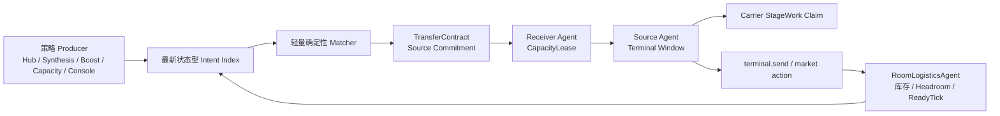

## Context

当前跨房物流虽然运行在同一个 Screeps bundle 中，却存在多套互不完整的控制面：Hub、Synthesis、PowerBank、capacity relief、survival energy 和 console 分别计算需求；`Memory.data.resourceControl.tasks` 只保存来源、目标、资源、剩余量和粗粒度 blocker；ResourceControl 再集中完成匹配、发送、staging、market 与 analytics。现有模型缺少以下边界：

- producer 的“需求”与 executor 的“动作”没有分离，Hub 既是策略中心又常被当作物理中转；
- priority 由 executor 解析 `reason` 字符串，任务没有稳定的业务优先级字段；
- source stock 与 receiver headroom 没有跨 tick 的唯一承诺所有者；
- terminal feed 只按房间+资源聚合，多个 carrier 没有持久 claim，global reset 后只能依赖进程内 board 重建；
- survival energy 直接 `terminal.send`，与 task send、market action 争用 terminal，却不共享进度账本；
- automatic task 的 merge/upsert 可能刷新 desired amount，却不能可靠区分需求修订与实际发送进度。

P0 `terminal-headroom-recovery` 负责共享水位、物理 headroom oracle、恢复性 offload 和 legacy staging admission。P1 必须复用这些安全事实，而不是重新定义 pressure/recovery 阈值。

“去中心化”在本项目中是逻辑所有权的去中心化，不是分布式系统共识：所有代码仍在单线程 tick 和共享 Memory 中运行。设计因此不需要 2PC、通用锁服务、event sourcing 或跨 shard 协议，只需要确定性匹配、receiver 单一授权、source 单一执行和可从 Memory 恢复的状态。

## Goals / Non-Goals

### Goals

- 把业务 producer 限定为“发布需求/供给”，把 receiver 容量授权和 source terminal side effect 分别交给对应房间的唯一逻辑 Agent。
- 用持久 TransferContract 统一所有跨房发送的幂等、数量守恒、优先级、阻塞、重试、改道、部分完成和 reset 恢复。
- 用 receiver 授予的短期 CapacityLease 防止跨 tick 和多 producer 重复承诺 headroom，同时保持发送前物理重验。
- 用 contract-aware、可过期的 carrier claim 防止重复 withdraw、过量 staging 和 global reset 后的丢单。
- 优先选择源到目标的直接路线，降低 Hub 容量与交易能耗；Hub 不可用时其他房间物流仍可运行。
- 保持候选计算、Memory 增长和每房执行工作有界，并用运行时指标证明安全、活性、公平性和 CPU 成本。

### Non-Goals

- 不实现纯 P2P 抢占、分布式共识、通用 lease/lock 框架、追加式事件日志或全局最优最小费用流。
- 不修改 P0 的容量水位、headroom recovery/offload 目标和 feed/offload 冲突规则。
- 不重新设计 energy、矿物、T3、boost、合成、PowerBank 或 market 定价阈值；除本变更明确规定的 terminal 仲裁顺序外，其他业务策略保持不变。
- 不改变 creep pathing/role 拓扑，不新增跨房 creep 搬运、多跳 terminal saga 或跨 shard 合同。
- 不重排 `src/main.ts` 的行为阶段；Agent 和 matcher 仍在现有 ResourceControl 阶段内执行。
- 不改变 console transfer 的调用入口；手工任务仍保持不因自动 TTL 取消、且不自动改道的语义。

## Decisions

### 1. 采用“房间所有权 + 全局纯匹配”的混合架构

每个有 storage/terminal 的房间运行一个逻辑 `RoomLogisticsAgent`，负责发布本房最新事实、receiver lease grant、source terminal action 与本地 staging。全局 matcher 只读取不可变的当轮快照和最新 intents，输出合同候选；它不直接搬运、不调用 terminal，也不能自行授予 receiver 容量。

选择该方案而不是纯 P2P，是因为 Screeps tick 是单线程共享 Memory：房间间消息与共识只会增加延迟和故障面。选择它而不是继续扩大 ResourceControl，是为了让容量授权和 terminal side effect 各有唯一 owner，并允许 Hub 退化为普通策略 producer。

### 2. Intent 只保存“最新目标”，不保存追加日志

每条 intent 使用稳定 `(producer, demandKey)`，并包含 `id`、`kind`、`roomName`、`resource`、`desiredAmount/availableAmount`、`priorityClass`、可选 `deadlineAt`、`revision`、`observedAt`、`expiresAt` 和约束（固定 source/target、min batch 等）。同一个 key 同时只允许一个 active revision：

- 相同 revision 重放是无副作用操作；
- revision 增加表示当前目标发生变化，不表示物流已经取得进展；
- 需求量增加只为未承诺 delta 创建新合同；需求量减少优先撤销尚未 staging 的最新合同余量；
- 只有新的业务需求周期才更换 `demandKey`，从而避免把已交付量重新写回 remaining；
- 过期或撤销 intent 不再产生新合同，但不会抹掉已完成合同审计信息。

Room agent 的 offer 必须由当前库存减去 energy/mineral/T3/生产保护和所有 active source commitments 得到。Headroom intent 只报告 P0 oracle 的物理事实、同 tick projection、terminal cooldown/ready tick 和 energy fee budget；尚未完成的 offload 不得被发布成即时容量。

不采用 event sourcing：本项目只需要当前调度事实，bounded contract history 足以审计，追加 intent 日志会无上限扩大 Memory。

### 3. TransferContract 是唯一跨房发送账本

合同核心字段如下：

| 类别 | 字段 |
|---|---|
| 身份 | `id`、`schemaVersion`、`producer`、`demandKey`、`intentRevision`、`idempotencyKey` |
| 路线 | `sourceRoom`、`targetRoom`、`resource`、`origin`、`supersedesContractId?` |
| 调度 | `priorityClass`、`createdAt`、`deadlineAt?`、`nextAttemptAt` |
| 数量 | `committedAmount`、`remainingAmount`、`deliveredAmount`、`stagedAmount` |
| 状态 | `state`、`blockerCode?`、`blockedSince?`、`attemptCount`、`lastProgressAt` |
| 授权 | `capacityLeaseId?`、`leaseEpoch?`、`sourceCommitmentAmount` |

active 状态为 `planned`、`staging`、`ready`、`blocked`；终态为 `done`、`cancelled`、`failed`、`superseded`。必须始终满足：

- `committedAmount = deliveredAmount + remainingAmount`，各值非负；
- active 合同有 `0 <= stagedAmount <= remainingAmount`；
- 同一 source/resource 的 automatic `sourceCommitmentAmount` 总和不超过统一保护规则下的安全可用库存；
- 合同创建后的 source、target、resource、origin 和 committed amount 不原地修改；改变路线或承诺量必须创建 successor revision；
- 创建/迁移完成后，只有 `terminal.send` 返回 `OK` 才能减少 remaining、增加 delivered；intent refresh、lease renewal、heartbeat 和失败尝试都不算发送进度。

terminal state 不可复活。retarget 先为 successor 获得新 lease，再原子标记旧合同 `superseded` 并释放旧 lease/claim；不得原地偷偷更换 receiver。已经 staging 的资源是可替代的 aggregate 库存，可在明确的 reallocation 事件后分配给 successor，但不追踪“每一单位矿物属于哪个合同”。

automatic 合同按 blocker 设置有界指数退避或精确 ready tick；条件恢复后可清除 blocker 并重新申请 lease，无需 producer 重建 intent。manual 合同不因自动 no-progress TTL 取消、也不自动 retarget，但其 lease/claim 仍可过期，且发送前仍受物理容量与 fee 约束。

### 4. Source commitment 与 receiver CapacityLease 分工

source stock 不使用通用 lease；合同的 `sourceCommitmentAmount` 就是该资源的唯一发送承诺，并在创建、staging 和发送前从 aggregate 安全库存中重验。automatic 合同不能突破业务保护线；manual 合同保留现有显式操作语义，但不能突破物理库存、receiver 容量和交易费约束。

receiver capacity 使用独立 `CapacityLease`：`id`、`contractId`、`receiverRoom`、`resource`、`amount`、`epoch`、`grantedAt`、`expiresAt`、`state`。只有 receiver RoomLogisticsAgent 可以 grant/renew/consume/release：

- grant 使用 P0 capacity index，并同时扣除 active leases、尚未迁移的健康 legacy commitment 和本 tick accepted sends；
- lease 同时占用 terminal/storage 共享总容量池和 resource-specific 容量，不能只按资源独立相加；
- renew/revalidate 排除同一合同的旧 lease，避免自我重复扣减；
- 只给位于 source 当前或下一 terminal send window 的合同授予或续约一个批次的容量，防止长期囤积 headroom；
- 无续约自动过期，合同终态或 retarget 立即释放；lease 过期本身不取消 manual 合同；
- send 前仍调用 P0 物理 headroom oracle，lease 是 reservation，不是容量仍然存在的证明。

`terminal.send(OK)` 后，lease 转为同 tick received debit，直到共享 projection 已纳入本次到达；不得释放后按旧快照二次出租，也不得在已应用 post-send delta 后双重扣减。

### 5. Matcher 使用硬约束、确定性排序和条件式公平

matcher 仅在 active demand 的资源索引中检查 active offers。硬约束先过滤 same-room、过期 intent、保护库存不足、receiver 非法/无 headroom、fee budget 不足、固定端点不匹配和无 terminal readiness 的候选；然后按以下显式 priority class 排序：

1. `deadline`：有明确截止时间的 boost/合成补给；
2. `capacity_emergency`；
3. `survival_energy`；
4. `operator`；
5. `production`；
6. `capacity_pressure`；
7. `balance`；
8. `market`。

首版 producer 按现有 origin/reason 和本变更明确规定的紧急顺序映射这些 class，executor 不再解析 reason 决策。class 内依次比较 deadline/等待年龄、receiver/source 压力、terminal ready tick、预计交易能耗比和稳定 key；相同输入必须产生相同结果。普通物流优先直接 source→target，只有业务 intent 明确要求 Hub 时才经过 Hub。

aging 仅在非硬紧急 class 内按配置逐级提升，永不越过 `survival_energy`；全局工作预算不足时使用持久 round-robin cursor 轮换 source。系统只承诺条件式弱公平：当更高优先级流量有限且合同持续可执行时，它最终会进入 send window；无限 emergency 流量下不承诺低优先级绝对无饥饿。

不采用全局最优流算法：它会形成房间×房间×资源扫描和更高 CPU，且每 tick 库存变化会迅速使最优解失效。确定性贪心、短租约和后续重匹配能以更低成本达到目标。

### 6. 每房单一 Agent 仲裁 terminal 与 staging

RoomLogisticsAgent 在现有 ResourceControl 阶段内每房运行一次，并成为 terminal side effect 的唯一入口：

- source 侧每个 cooldown/send window 最多选择一个合同；只有它能调用 `terminal.send`；
- market buy/sell proposal 也必须经同一 Agent 仲裁，避免 `Game.market.deal` 与合同绕开 `terminalBusy`，但 market 定价和阈值保持不变；
- receiver 侧 grant CapacityLease，并发布 P0 物理 headroom；
- source 侧为当前/下一 send window 生成 `StageWork(contractId, resource, amount)`；
- Intake/offload 继续复用 P0 的 headroom recovery，计划中的 offload 不提前授权容量。

StageWork claim 持久化到 Memory，至少包含 `contractId`、`workId`、`creepName`、`claimedAmount`、`phase`、`claimedAt`、`leaseUntil`。同一工作全部 active claims 不得超过待 staging 量；carrier 成功取货后进入 `carrying`，成功交付 terminal 后增加 aggregate staged amount 并释放 claim。claim/contract 失效且 creep 已持货时，Agent 必须明确选择：重分配给同资源已获 admission 的工作，或安全退回 storage/terminal；不得落入 generic energy delivery。

terminal 中同资源是可替代 aggregate，Agent 只保证所有 admitted staging 分配之和不超过实际安全 terminal 库存。同房同资源同轮不得同时 feed/offload。carrier 死亡、claim 过期、board refresh 或 global reset 后，Agent 仅凭 Memory 与 creep/store 事实回收或重建 claim。

发送前 Agent 必须重验 active lease、P0 headroom、source commitment、实际库存、fee 和 terminal readiness。`OK` 后在同一 tick 原子更新合同进度、lease consumption、source/receiver projection 与 runtime action；失败只增加 attempt/设置 blocker，不改变 delivered/remaining。

### 7. 数据结构与 CPU 工作必须有界

Intent、active contract、lease 和 claim 分别建立按 resource、source、target、state 的索引，每轮构建一次并在 matcher/agents/observability 间复用。Producer 只在值跨阈值、revision 变化或 TTL 续期时标记 dirty；常规 matcher 沿用现有约 10-tick cadence，deadline、capacity emergency 和 survival energy 可以触发 urgent wake。

候选评估使用可配置上限和 continuation cursor；缓存 source-target 距离/交易费因子；terminal cooldown 期间不重复尝试 send。终态合同只保留有界审计窗口或聚合统计，详细 action history 使用 ring buffer。

在固定 live-like fixture 上，合同模式 ResourceControl p95 CPU 目标不得高于 P0 基线 10%，且不得新增每房全表扫描。线上 rollout 以变更前约 3.224 的 ResourceControl 120-tick 平均值作为参考，但以同一部署前后的可比采样决定是否回滚。

### 8. 观测是执行状态的投影，不是第二状态源

`Memory.runtime.logistics` 从 intent/contract/lease/claim store 投影：

- 按 origin/priority/state/blocker 的数量、总 remaining、oldest age 和 p50/p95 状态耗时；
- source commitment、receiver lease granted/used/expired、same-tick debit；
- admitted/staged/claimed/orphan cargo 与 stage/send throughput；
- 每 source wait、budget skip、aging promotion 与 route transaction cost；
- 幂等重复、数量守恒、source overcommit、receiver overlease、overclaim、terminal 双 owner 等不变量违规计数；
- matcher candidate evaluations、索引构建次数、Memory 项数/字节和模块 CPU。

monitor 只读这些投影，并兼容字段缺失的 legacy/P0 快照。观测不得被 matcher 或 Agent 反向读取作为调度事实。

## Risks / Trade-offs

- **[迁移时重复执行]** legacy task 与 contract 可能同时发送或重复占容量 → 每个 demand 只允许一个 `executionAuthority`；迁移标记、contract 和 legacy skip 在同一 Memory 更新中完成。
- **[租约囤积导致假满]** cooldown 或低优先级合同可能长期续约 → 只给当前/下一 send window 一个批次，按 progress/TTL 续约，终态立即释放。
- **[source commitment 与真实库存漂移]** 生产或其他模块可能消耗已承诺资源 → 每次 staging/send 重验 aggregate 保护库存，阻塞或 supersede automatic 合同，不伪造进度。
- **[staging 资源不可物理标记]** 多合同同资源无法追踪每一单位 → 只做 aggregate allocation 与有界 claim，不设计虚假的逐单位所有权。
- **[market 绕过单 owner]** 保留旧 market direct action 会重新引入 terminal 竞争 → market 只提交 proposal，由同一 Agent 执行；定价策略不变。
- **[优先级迁移改变顺序]** 明确的新紧急顺序与隐式历史顺序并不完全一致 → 为每类现有 reason 建立预期 class 的 golden test，shadow 模式逐项确认差异均来自已批准顺序。
- **[条件式公平仍可能饥饿]** 无限紧急流量可持续压制普通均衡 → 明确只承诺条件式弱公平，并观测 max wait/aging promotion，必要时由业务策略调整配额。
- **[Memory/CPU 增长]** 合同、lease、claim 和索引增加成本 → 最新状态 intent、有界历史、按资源索引、dirty cadence、candidate budget 和 rollout CPU gate。
- **[P0/P1 双重预留]** P0 legacy commitment 与 P1 lease 可能重复扣减 → cutover 后 active lease 是迁移合同唯一 receiver 承诺；只有未迁移且仍健康的 legacy task 继续进入 P0 commitment index。

## Migration Plan

1. **前置**：先完成并验证 `terminal-headroom-recovery`；共享 headroom policy/oracle 是 CapacityLease 的唯一容量来源。
2. **基础设施关闭态**：加入 versioned stores、显式 priority mapping、contract/lease/claim 单元测试和 feature flags，默认不产生 side effect。
3. **Shadow**：producer 发布 latest intents，matcher 只输出 comparison/runtime，不创建 active lease、不执行 send；与现有 task/energy/market 决策比较 route、priority、容量和 CPU。
4. **单一 authority 迁移**：按 origin/room canary。对每个 legacy task 一次性创建带 `legacyTaskId` 的 contract，保存 `delivered = amount - remaining`，并原子写入 `migratedContractId/executionAuthority=contract`；legacy executor 必须跳过已迁移项，P0 只统计未迁移健康 commitment。
5. **房间 Agent canary**：先迁移普通自动任务，再迁移 capacity/synthesis/boost，最后把 survival energy direct send、console transfer 和 market action 接入 Agent。每阶段观察至少两个业务周期和 reset fixture。
6. **全量启用**：所有跨房发送只经 contract + receiver lease + source Agent，Hub 仅发布策略 intent；保留 legacy read adapter 一个观察窗口。
7. **清理**：确认无 legacy authority、无回滚需求后，删除 reason-string executor、direct energy send 和房间+资源 legacy staging adapter。

回滚时先停止创建新合同和 Agent side effect，再把 active contract 的未发送 remainder 物化为单个 legacy task，标记合同 `cancelled/rolled_back`，释放 lease/claim，并把 execution authority 原子交还 legacy。已 delivered 数量不得重放；terminal 中的 aggregate staging 由 legacy feed 或 P0 offload 安全接管。旧 console API 和 P0 runtime 保持可用。

## Open Questions

无阻塞问题。lease TTL、aging interval、candidate budget 和历史保留长度均作为配置默认值，在 shadow/canary 数据下校准，不改变上述安全不变量。
